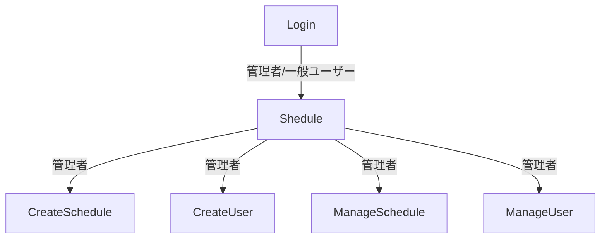
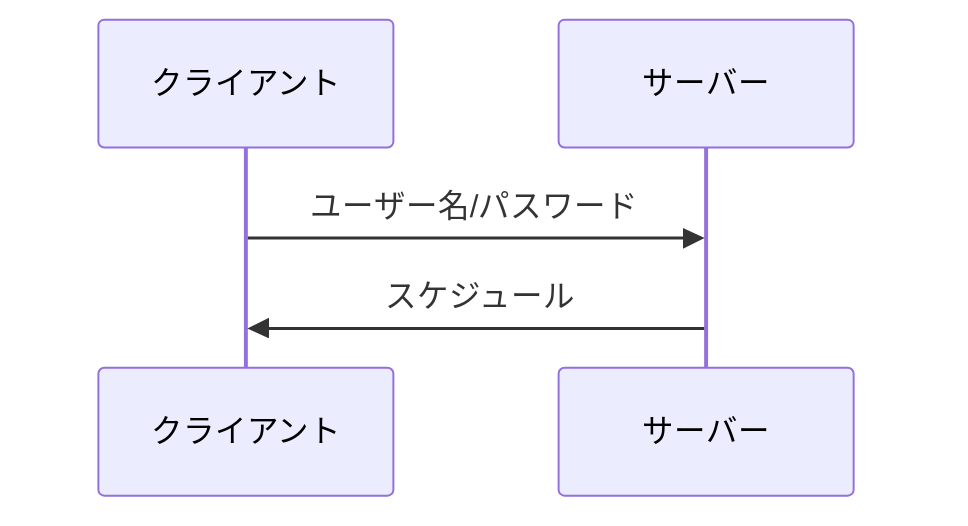
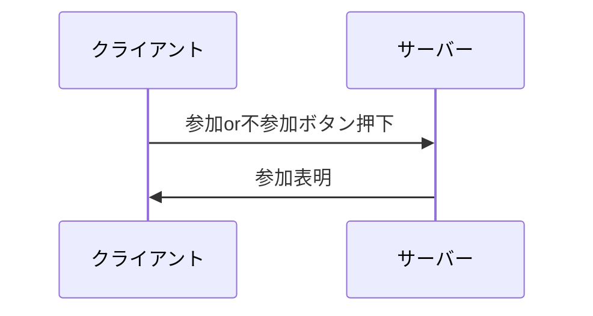
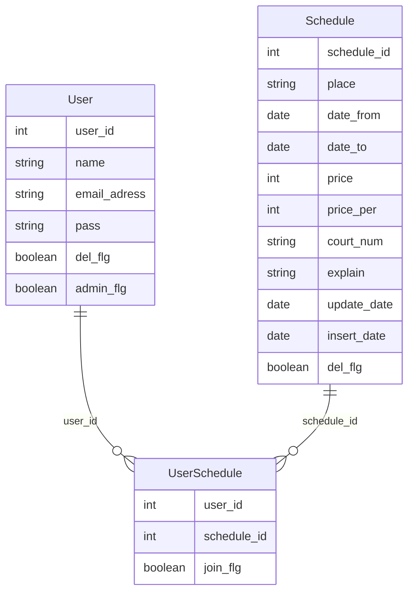

# むさこっこ運用フロー
## 画面遷移

```mermaid
graph TD;
    Login --> |管理者/一般ユーザー|Shedule
    Shedule --> |管理者|CreateSchedule
    Shedule --> |管理者|CreateUser
    Shedule --> |管理者|ManageSchedule
    Shedule --> |管理者|ManageUser
``` 
## 一般ユーザー
- ログイン

```mermaid
sequenceDiagram
    クライアント->>サーバー:ユーザー名/パスワード
    サーバー->>クライアント:スケジュール
```
- 参加表明

```mermaid
sequenceDiagram
    クライアント->>サーバー:参加or不参加ボタン押下
    サーバー->>クライアント:参加表明
```
## ER

```mermaid
erDiagram
    User || -- o{ UserSchedule : user_id
    User{
        int user_id
        string name
        string email_adress
        string pass
        boolean del_flg
        boolean admin_flg
    }
    Schedule || -- o{ UserSchedule : schedule_id
    Schedule{
        int schedule_id
        string place
        date date_from
        date date_to 
        int price
        int price_per
        string court_num
        string explain
        date update_date
        date insert_date
        boolean del_flg
    }
    UserSchedule{
        int user_id
        int schedule_id
        boolean join_flg
    }
```