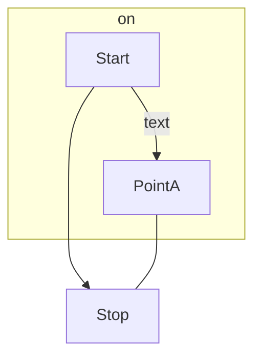
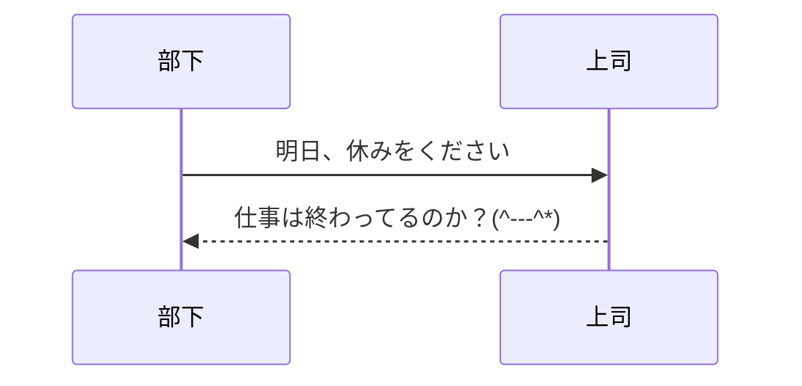

```mermaid
graph TD;
    A-->B;
    A-->C;
    B-->D;
    C-->D;
```

```mermaid
flowchart TD
    Start --> Stop
    subgraph on
    Start --> |text|PointA
    end
    PointA --- Stop
``` 

```mermaid
sequenceDiagram
    部下->>上司: 明日、休みをください
    %% this is a comment
    上司-->>部下: 仕事は終わってるのか？(^---^*)
```